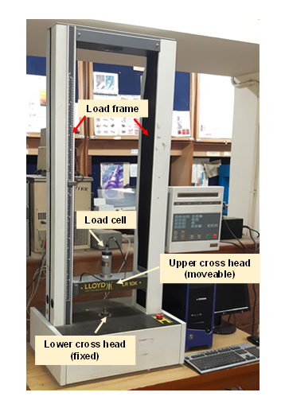
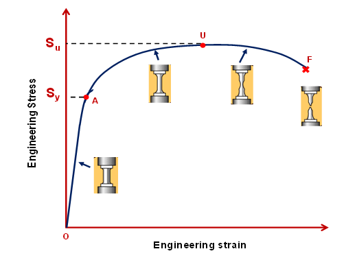
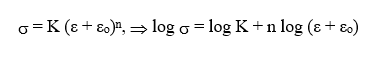
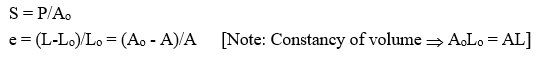
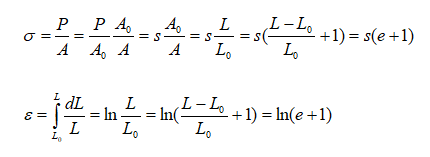
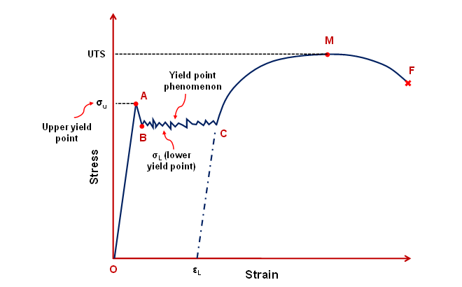

<b>Brief description of the equipment/machine:</b> A typical Universal Testing Machine is shown in Fig. 1. The one shown in figure, is a 10 kN capacity testing machine and is screw driven. While the lower cross head is fixed, the upper cross head is movable and is fitted with the transducer type ‘load cell’. This testing machine can also be used for compression, torsion, bend/flexural and for high temperature tensile tests with other accessories.  
  
Fig. 1: Llyod testing machine in Materials Testing Lab  
<b>Typical Tensile Curve:</b> Typical stress-strain curve for a polycrystalline metal is shown in Fig. 2. The common definitions of yield strength (Sy) and ultimate tensile strength (Su) of ductile metals are illustrated in Fig. 2. OA is the elastic regime. Yield strength is defined as the stress value corresponding to a strain value of 0.002 (draw parallel line to OA from a strain value of 0.002 and the intersection point is A – corresponding to Sy). Point at maximum load (U), at which an unstable neck initiates, gives the ultimate tensile strength (or tensile strength) Su. The sample fractures at F.  
  
Fig. 2: Engineering stress-strain curve for a polycrystalline metal  
<b>Definitions and properties within elastic limit</b>  
<b><i>Hooke’s law</i></b>: Within elastic limit, the deformation is proportional to load, i.e., strain is proportional to stress 
<b><i>Young’s modulus of elasticity, E</i></b>: The ratio of stress to strain below elastic limit 
<b><i>Offset yield strength Sy</i></b>: Stress corresponding to the intersection of the stress-strain curve and a line parallel to the elastic part of the curve offset by strain 0.002 
<b><i>Resilience (UR)</i></b>: The maximum energy absorbed per unit volume within elastic limit 
Modulus of resilience (UR) = 0.5 * Syey  
<b>Definitions and properties in the plastic region</b>  
<b><i>Strain hardening</i></b>: The relationship between stress and strain is nonlinear during plastic deformation. Like E in elastic range, strength coefficient (K), strain hardening exponent (n) and amount of strain hardening prior to test (εo) are used to characterize material in plastic range
  
<b><i>Ultimate tensile strength</i> (Su)</b>: The maximum engineering stress before rupture  
Su = Pmax/Ao 
<b><i>Toughness</i> (UT)</b>: Ability to absorb energy per unit volume up to fracture 
<b><i>Percentage of Total Elongation at Fracture</i></b> = (Lf - Lo)/Lo*100 
<b><i>Percentage Reduction in Area</i></b> = (Ao-Af)/Ao *100, Maximum change in cross-sectional area which has occurred during the test (Ao-Af) expressed as a percentage of the original cross-sectional area (Ao), where Af is the final cross-sectional area.
  
<b>Nomenclature</b>  
A	&nbsp;&nbsp;Instantaneous area (mm2) 
Ao	&nbsp;&nbsp;Original area of cross-section at gauge length (mm2) 
Af&nbsp;&nbsp;	Area in the neck region after failure (mm2) 
E &nbsp;&nbsp;	Young’s modulus of elasticity (GPa) 
e	&nbsp;&nbsp; Engineering strain 
ey	&nbsp;&nbsp; Engineering strain at yield point 
ef &nbsp;&nbsp;	Engineering strain at failure 
ε &nbsp;&nbsp;	True strain	 
εo	&nbsp;&nbsp;Strain before starting the test 
K &nbsp;&nbsp; Strength coefficient (N/m2, Pa) 
L	&nbsp;&nbsp;Instantaneous gauge length (mm) 
Lo	&nbsp;&nbsp;Original gauge length - gauge length before application of load (mm) 
Lf &nbsp;&nbsp;	Gauge length after rupture of the specimen (mm) 
n	&nbsp;&nbsp; Strain hardening exponent 
P	&nbsp;&nbsp;Instantaneous load/force (N) 
Pmax	&nbsp;&nbsp;Maximum load/force (just before necking) (N) 
S	&nbsp;&nbsp; Engineering stress (MPa) 
Sy	&nbsp;&nbsp;Yield stress (MPa) 
Su	&nbsp;&nbsp;Ultimate tensile strength (MPa) 
&sigma;	&nbsp;&nbsp;True stress (MPa) 
t	&nbsp;&nbsp; time (s) 
UR &nbsp;&nbsp;	Modulus of resilience (J/m3) 
UT &nbsp;&nbsp;	Toughness (J/m3)  
<b>Formulas</b>  
<b>a)	Engineering stress and engineering strain</b> 
 
 <b>b)	True stress and true strain</b> 
 
<b>Tensile Testing of Steel</b>
A typical stress-strain curve for a medium carbon steel is shown in Figure -3. The elastic-plastic transition is not very well defined and occurs abruptly in what is termed a yield point phenomenon. The normal elastic extension (region OA) is terminated at a stress level known as the upper yield point (σu). Plastic deformation is initiated at Point ‘A’ with an actual decrease in stress. Continued deformation fluctuates slightly about some constant stress value (region BC), termed the lower yield point (σL). Deformation at this stage is not homogeneous. In a portion of the tensile sample where there is a stress concentration, a deformation band appears, called Lüder bands. Beyond point C, to the ultimate tensile stress at M, deformation is essentially homogeneous and thereafter necking develops, leading to normal ductile fracture at F. We will learn more about the mechanism about this phenomenon in a later lab. 
 
Fig. 3: Schematic stress-strain curve of a mild steel showing the yield point phenomenon 

